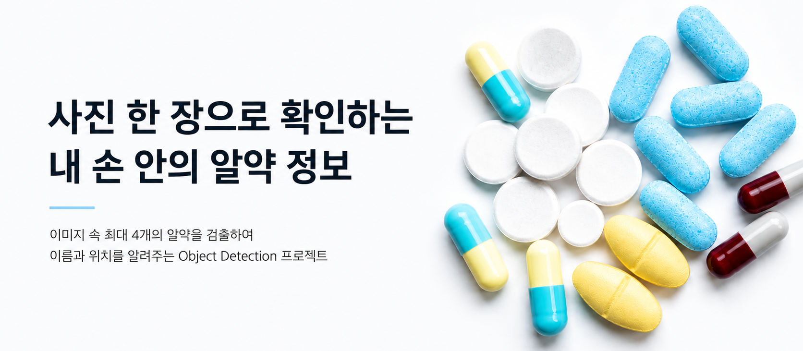
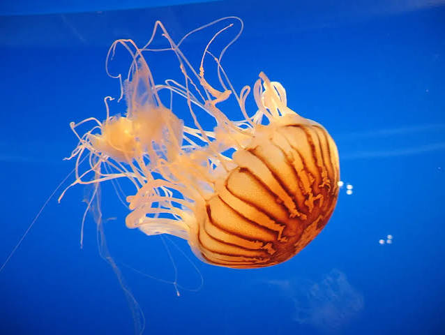

# 💊 Pill-Detection

<div align="center">
  
</div>

Repo URL : [](https://github.com/codeit-ai12-team2/pill-detection)

<br/>

## 📋 Project Overview

헬스케어 스타트업 **헬스잇(Health Eat)** 의 AI 엔지니어링 팀을 가정하여, 모바일 앱 기반 알약 인식 서비스의 핵심 모델을 개발하는 프로젝트입니다.

약사가 아닌 일반 유저는 본인이 복용 중인 약의 이름이나 종류, 함께 복용하면 안 되는 약의 조합 등을 정확히 알기 어렵다는 것이 현재의 문제입니다.

유저가 약을 모바일로 촬영하면 이러한 정보를 자동으로 제공할 수 있다면, 유저의 건강 상태 관리는 물론 병용 금지 약물 안내 등 헬스케어 서비스로서의 비즈니스 가치를 창출할 수 있습니다.

따라서 이미지 한 장에 담긴 최대 4개의 알약을 대상으로 **클래스** 와 **바운딩 박스** 를 검출하는 Object Detection 모델을 구현하고, 실사용이 가능한 수준까지 성능을 고도화합니다.

<br/>

## 🎬 Demo

<div align="center">

[](https://www.youtube.com/watch?v=gA4zGYYqIOQ)

<sub> < 알약 사진을 촬영하면 이름과 위치를 인식하는 애플리케이션 시연 영상입니다. > </sub>

</div>

<br/>

## 😄 Team Member

<div align="center">

<table>
    <tr align="center">
        <td></td>
        <td></td>
        <td></td>
        <td></td>
    </tr>
    <tr align="center">
        <td><b>김완수/PM</b></td>
        <td><b>안찬형</b></td>
        <td><b>임현진</b></td>
        <td><b>최승원</b></td>
    </tr>
    <tr align="center">
        <td>
            <br/>
            <br/>
            
        </td>
        <td>
            <br/>
            <br/>
            
        </td>
        <td>
            <br/>
            <br/>
            
        </td>
        <td>
            <br/>
            <br/>
            
        </td>
    </tr>
</table>

</div>

<br/>

## 🔗 Reference

| 문서 | 링크 |
| :--: | :--: |
| 📎 EDA README | [바로가기](ai/README.md) |
| 📎 app/iOS README | [바로가기](app/iOS/README.md) |

<br/>

## 🗂️ Project Structure

```
📦 pill-detection
┣ 📂 .images
┣ 📂 ai
┃ ┣ 📂 outputs
┃ ┃ ┣ 📂 yolo11s
┃ ┃ ┣ 📂 yolo26l-17
┃ ┃ ┣ 📂 yolo26l-21
┃ ┃ ┣ 📂 yolo26l
┃ ┃ ┗ 📂 yolo26s
┃ ┣ 📂 src
┃ ┃ ┣ 📂 rt_detr
┃ ┃ ┣ 📂 util
┃ ┃ ┣ 📂 visual
┃ ┃ ┣ 📂 yolo
┃ ┃ ┣ 📂 yolo26l_refine
┃ ┃ ┣ 📝 dataset.py
┃ ┃ ┗ 📝 init.py
┃ ┣ 📃 README.md
┃ ┣ 📃 requirements.txt
┃ ┣ 📃 requirements_for_runpod.txt
┃ ┗ 📃 requirements_for_runpod 2.txt
┣ 📂 app/iOS
┃ ┣ 📂 Pillaw.xcodeproj
┃ ┣ 📂 Pillaw
┃ ┣ 📂 PillawTests
┃ ┣ 📂 PillawUITests
┃ ┗ 📃 README.md
┗ 📃 README.md
```

<br/>

## 🌿 Team Git Rule's

### ✅ Code Style

`Black` or `Ruff` 확장 프로그램 사용

### ✍️ Comments

- Google Style  
- 간단한 method의 경우 `$DESCRIPTION$`만 사용

```python
"""
$DESCRIPTION$

Args:
    $PARAMS$: param

Returns:
    $RETURN$:

Raises:
    $EXCEPTION$
"""
```

### 📝 Commit Rule

| Prefix | 설명 |
| :--: | :-- |
| `feat` | 새로운 기능 추가 |
| `fix` | 버그 수정 |
| `docs` | 문서 수정 (README 등) |
| `style` | 포맷 변경 (코드 동작 무관) |
| `refactor` | 리팩토링 |
| `test` | 테스트 추가/수정 |
| `chore` | 빌드, 패키지 설정 변경 |

## 📚 협업일지

| 월 | 화 | 수 | 목 | 금 |
| --- | --- | --- | --- | --- |
|  |  |  |  | **2026.06.26**<br/>📒 [데일리브리핑](https://app.notion.com/p/38ba35cd00a98030a6c8d928db044155?source=copy_link)<br/> [김완수](https://app.notion.com/p/Daliy-Log-38ba35cd00a98031806bcb6b371c3d4b?source=copy_link)<br/> [안찬형](https://app.notion.com/p/Daliy-Log-38ba35cd00a98032b720fc77ad2ffec1?source=copy_link)<br/> [임현진](https://app.notion.com/p/Daliy-Log-38ba35cd00a980a6ba74ebbebca3f056?source=copy_link)<br/> [최승원](https://app.notion.com/p/Daliy-Log-38ba35cd00a980f9a88fc986b444a090?source=copy_link) |
| **2026.06.29**<br/>📒 [데일리브리핑](https://app.notion.com/p/38ea35cd00a98096b967cbda4e055976?source=copy_link)<br/> [김완수](https://app.notion.com/p/Daliy-Log-38ea35cd00a980fe8edfece17b88bae4?source=copy_link)<br/> [안찬형](https://app.notion.com/p/Daliy-Log-38ea35cd00a9808fbbb0ca8ef19b20b3?source=copy_link)<br/> [임현진](https://app.notion.com/p/Daliy-Log-38ea35cd00a980758328f621174aa791?source=copy_link)<br/> [최승원](https://app.notion.com/p/Daliy-Log-38ea35cd00a9809b8d63fdedde030978?source=copy_link) | **2026.06.30**<br/>📒 [데일리브리핑](https://app.notion.com/p/38fa35cd00a9804e9d07cb3b51a553a8?source=copy_link)<br/> [김완수](https://app.notion.com/p/Daliy-Log-38fa35cd00a980f982deffad00cc7a2d?source=copy_link)<br/> [안찬형](https://app.notion.com/p/Daliy-Log-38fa35cd00a980dab0b5d4a3885cf64e?source=copy_link)<br/> [임현진](https://app.notion.com/p/Daliy-Log-38fa35cd00a980708b66cf08e0fb6cf2?source=copy_link)<br/> [최승원](https://app.notion.com/p/Daliy-Log-38fa35cd00a980f8aa07d1acfdb11d6d?source=copy_link) | **2026.07.01**<br/>📒 [데일리브리핑](https://app.notion.com/p/390a35cd00a980ad8f80ea846bc9eada?source=copy_link)<br/> [김완수](https://app.notion.com/p/Daliy-Log-390a35cd00a980d9a93ae43c08bea4fc?source=copy_link)<br/> [안찬형](https://app.notion.com/p/Daliy-Log-390a35cd00a9806f98acc6ec57db5486?source=copy_link)<br/> [임현진](https://app.notion.com/p/Daliy-Log-390a35cd00a98061b21ac8500378a6fb?source=copy_link)<br/> [최승원](https://app.notion.com/p/Daliy-Log-390a35cd00a9802f9820f58df6be6865?source=copy_link) | **2026.07.02**<br/>📒 [데일리브리핑](https://app.notion.com/p/390a35cd00a98098977af81535f85488?source=copy_link)<br/> [김완수](https://app.notion.com/p/Daliy-Log-390a35cd00a98049a8f1e48ad3d33d32?source=copy_link)<br/> [안찬형](https://app.notion.com/p/Daliy-Log-391a35cd00a980199108d686c71d85c8?source=copy_link)<br/> [임현진](https://app.notion.com/p/Daliy-Log-391a35cd00a980ec88b7f6883310a3ac?source=copy_link)<br/> [최승원](https://app.notion.com/p/Daliy-Log-391a35cd00a9805893ebd6fba6f78523?source=copy_link) | **2026.07.03**<br/>📒 [데일리브리핑](https://app.notion.com/p/392a35cd00a9804e9389f1bfa7c6d126?source=copy_link)<br/> [김완수](https://app.notion.com/p/Daliy-Log-392a35cd00a9803e9068e55014b469d1?source=copy_link)<br/> 안찬형(휴가)<br/> [임현진](https://app.notion.com/p/Daliy-Log-392a35cd00a9804e918be177bb83f805?source=copy_link)<br/> [최승원](https://app.notion.com/p/Daliy-Log-392a35cd00a980f8a170fef26f474755?source=copy_link) |
| **2026.07.06**<br/>📒 [데일리브리핑](https://app.notion.com/p/395a35cd00a98027971ade3beaf5b37e?source=copy_link)<br/> [김완수](https://app.notion.com/p/Daliy-Log-395a35cd00a980368510e1bc08267bcf?source=copy_link)<br/> [안찬형](https://app.notion.com/p/Daliy-Log-395a35cd00a980e6a312d8c0e4b1876b?source=copy_link)<br/> [임현진](https://app.notion.com/p/Daliy-Log-395a35cd00a9809f8388d8b7f43ad161?source=copy_link)<br/> [최승원](https://app.notion.com/p/Daliy-Log-395a35cd00a980df89d9e153cb1bdf9d?source=copy_link) | **2026.07.07**<br/>📒 [데일리브리핑](https://app.notion.com/p/396a35cd00a980bf9284c174f74d9381?source=copy_link)<br/> [김완수](https://app.notion.com/p/Daliy-Log-396a35cd00a980b8a2d5c2d932c7e708?source=copy_link)<br/> [안찬형](https://app.notion.com/p/Daliy-Log-396a35cd00a98048a1c7f0bda9cb8612?source=copy_link)<br/> [임현진](https://app.notion.com/p/Daliy-Log-396a35cd00a9808f96d9e324b8bf410e?source=copy_link)<br/> [최승원](https://app.notion.com/p/Daliy-Log-396a35cd00a980968ff1da712962940a?source=copy_link) | **2026.07.08**<br/>📒 [데일리브리핑](https://app.notion.com/p/397a35cd00a9808a857dc192b3f92aae?source=copy_link)<br/> [김완수](https://app.notion.com/p/Daliy-Log-397a35cd00a980cabad1f7ef6209353f?source=copy_link)<br/> [안찬형](https://app.notion.com/p/Daliy-Log-397a35cd00a9806f86bcddadeff33a85?source=copy_link)<br/> [임현진](https://app.notion.com/p/Daliy-Log-397a35cd00a9802fb6c6e45368b938a9?source=copy_link)<br/> [최승원](https://app.notion.com/p/Daliy-Log-397a35cd00a980e1b1c8c135956bf8ad?source=copy_link) | **2026.07.09**<br/>📒 [데일리브리핑](https://app.notion.com/p/398a35cd00a9801aa609eb39f0eee5b8?source=copy_link)<br/> [김완수](https://app.notion.com/p/Daliy-Log-398a35cd00a980fd8de8f5f43f6a1132?source=copy_link)<br/> [안찬형](https://app.notion.com/p/Daliy-Log-398a35cd00a980ec90c0d1429d84fb03?source=copy_link)<br/> [임현진](https://app.notion.com/p/Daliy-Log-398a35cd00a9805b8cd4f090943fe14b?source=copy_link)<br/> [최승원](https://app.notion.com/p/Daliy-Log-398a35cd00a9806a87ecc6fc4264ee5b?source=copy_link) | **2026.07.10**<br/>📒 [데일리브리핑](https://app.notion.com/p/399a35cd00a980d0b8bac6903a6d0b67?source=copy_link)<br/> [김완수](https://app.notion.com/p/Daliy-Log-399a35cd00a98090ac02d2064e266c12?source=copy_link)<br/> [안찬형](https://app.notion.com/p/Daliy-Log-399a35cd00a9800da296ec37ceaa1bda?source=copy_link)<br/> [임현진](https://app.notion.com/p/Daliy-Log-399a35cd00a98081ae4ddd106cef2931?source=copy_link)<br/> [최승원](https://app.notion.com/p/Daliy-Log-399a35cd00a9808da665c5d6fa67120f?source=copy_link) |
| **2026.07.13**<br/>📒 [데일리브리핑](https://app.notion.com/p/39ca35cd00a98049951dfb82866e499b?source=copy_link)<br/> [김완수](https://app.notion.com/p/Daliy-Log-39ca35cd00a980dd8ba6c60a4b6eca22?source=copy_link)<br/> [안찬형](https://app.notion.com/p/Daliy-Log-39ca35cd00a980169b54cba53a914591?source=copy_link)<br/> [임현진](https://app.notion.com/p/Daliy-Log-39ca35cd00a98022a247daa5279650f8?source=copy_link)<br/> [최승원](https://app.notion.com/p/Daliy-Log-39ca35cd00a9807794edf11594595e7e?source=copy_link) | **2026.07.14**<br/>📒 [데일리브리핑](https://app.notion.com/p/39ca35cd00a980d9b3b0f3bfa507ec3e?source=copy_link)<br/> [김완수](https://app.notion.com/p/Daliy-Log-39ca35cd00a98042a1a1eec5e42ee7f8?source=copy_link)<br/> [안찬형](https://app.notion.com/p/Daliy-Log-39ca35cd00a980d5829ac7776beb2882?source=copy_link)<br/> [임현진](https://app.notion.com/p/Daliy-Log-39ca35cd00a98096ae86ef1a36caf770?source=copy_link)<br/> [최승원](https://app.notion.com/p/Daliy-Log-39ca35cd00a980259167ffff583ed135?source=copy_link) |  |  |  |
