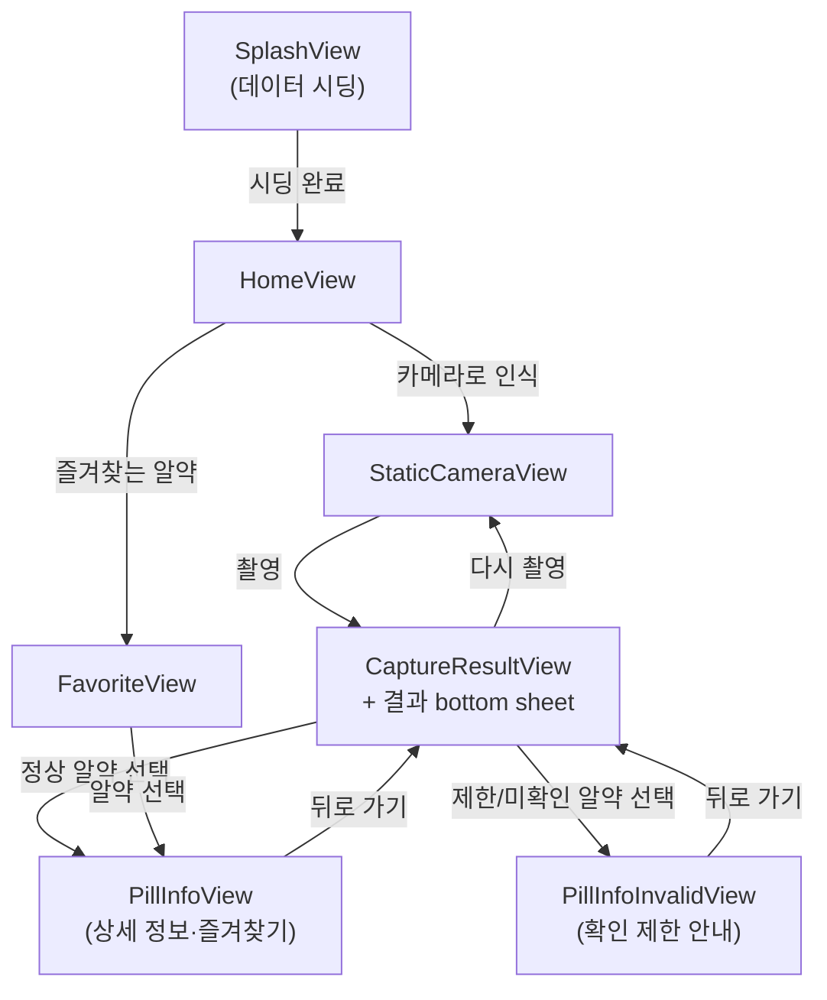

# 💊 Pillaw (iOS)

> 카메라로 알약을 비추면 어떤 약인지 알려주는 iOS 앱

Codeit 초급 프로젝트로 진행한 알약 탐지 앱입니다.
온디바이스 YOLO 모델로 카메라 프레임에서 알약을 감지하고, 식품의약품안전처 낱알식별 공공 API로 받아온 알약 정보를 SwiftData에 저장해 상세 정보(성분·효능·용법·주의사항)와 즐겨찾기 기능을 제공합니다.

| 항목 | 내용 |
|:-----|:-----|
| 최소 iOS 버전 | iOS 26.2 |
| UI | SwiftUI |
| 로컬 저장소 | SwiftData |
| ML | CoreML + Vision (Ultralytics YOLO26 export) |
| 아키텍처 | Presentation / Domain / Data 3-layer + MVVM |

---

## 1. 빌드를 위한 필수 세팅

### 1-1. 공공데이터포털 API 키 (필수)

알약 정보는 [식품의약품안전처_의약품 낱알식별 정보](https://www.data.go.kr/data/15057639/openapi.do) API에서 가져옵니다.

1. 위 링크에서 **활용신청** 후 일반 인증키를 발급받습니다. (**Decoding 버전** 키를 사용해야 합니다)
2. 예시 파일을 복사해 `Secrets.swift`를 만들고 키를 채웁니다.

```bash
cp Pillaw/App/Config/Secrets.swift.example Pillaw/App/Config/Secrets.swift
```

```swift
// Pillaw/App/Config/Secrets.swift
nonisolated enum Secrets {
    static let GOV_API_KEY = "발급받은_인증키"
}
```

`Secrets.swift`는 `.gitignore`에 등록되어 있어 커밋되지 않습니다.

사용하는 엔드포인트는 `App/Config/API.swift`에 정의되어 있습니다.

```
https://apis.data.go.kr/1471000/MdcinGrnIdntfcInfoService03/getMdcinGrnIdntfcInfoList03
```

### 1-2. CoreML 모델

- 모델 파일: `Pillaw/App/Resources/yolo26.mlpackage` (Ultralytics YOLO26을 CoreML로 export한 것, 빌드 시 `yolo26.mlmodelc`로 컴파일됨)
- 저장소에 포함되어 있어 별도 다운로드는 필요 없습니다.
- 모델 파일이 번들에 없어도 앱은 정상 동작하며 **감지 기능만 비활성화**됩니다 (`PillDetectorRepoImpl` 참고).
- 모델을 교체할 때는 같은 이름(`yolo26.mlpackage`)으로 리소스를 바꾸거나 `PillDetectorRepoImpl.modelName`을 수정하면 됩니다.
- 현재 모델은 GPU/ANE 컴파일이 실패하는 이슈가 있어 **CPU 전용**(`computeUnits = .cpuOnly`)으로 실행합니다.

### 1-3. 매핑 CSV

모델의 클래스 인덱스와 API·상세 정보를 이어주는 CSV 두 개가 번들에 포함됩니다.

| 파일 | 역할 |
|:-----|:-----|
| `class_mapping.csv` | YOLO 클래스 인덱스 ↔ 낱알식별 API `item_seq` / `category_id` 매핑 |
| `pill_detail_mapping.csv` | `item_seq`별 성분·효능·용법·주의사항 (네트워크 없이 로컬 시딩) |

### 1-4. 첫 실행 (데이터 시딩)

첫 실행 시 Splash 화면에서 `class_mapping.csv`의 `item_seq`들로 API를 호출해 알약 정보를 SwiftData에 저장합니다.

- 공공 API 부하를 고려해 **동시 요청 5개**로 제한
- 이미 저장된 항목은 건너뛰므로 중간에 실패해도 다음 실행에서 이어받기
- API에서 조회되지 않는 알약은 `PillStatus.overrides`에 지정된 상태(`notFound` / `prohibited`)로 CSV 정보만 저장

---

## 2. 모델 실행 로직

카메라 프레임이 감지 결과가 되기까지의 흐름입니다.

```
AVCaptureSession (.high, 후면 광각)
  │  BGRA 픽셀 버퍼, 세로 방향(90°) 회전
  ▼
CameraRepoImpl (videoQueue)
  │  0.3초 간격 스로틀링 → AsyncStream<DetectionFrame>
  ▼
PillDetectorRepoImpl
  │  VNCoreMLRequest (scaleFill, confidence ≥ 0.25)
  │  ├─ NMS 포함 모델 → VNRecognizedObjectObservation 디코딩
  │  └─ end2end 모델 → raw tensor(1×300×6: x1,y1,x2,y2,conf,class) 직접 디코딩
  ▼
PillDetection (classIndex, categoryId, confidence, boundingBox)
  │  class_mapping.csv의 classIndex → categoryId 매핑
  ▼
CameraVM
  │  categoryId → SwiftData에서 Pill 조회 (pillCache로 프레임당 재조회 방지)
  │  신뢰도 ≥ 0.75만 목록에 표시, 감지가 끊겨도 1초간 유지(깜빡임 방지)
  ▼
UI (실시간 목록 / bbox 오버레이)
```

**촬영(캡처) 시**에는 추가로:

1. 현재 프레임을 정지 이미지(CGImage)로 변환하고 같은 모델로 감지
2. aspect-fill로 잘려 **화면에 보이지 않는 영역의 감지는 제외** (`visibleRect`)
3. 화면 위쪽부터 순서대로 번호를 매겨 bbox와 bottom sheet 목록에 표시
4. 항목을 누르면 상태에 따라 상세 화면(`PillInfoView`) 또는 제한 안내(`PillInfoInvalidView`)로 이동

첫 `detect` 호출 시점에 videoQueue에서 모델을 lazy 로드하므로 화면 전환 중 메인 스레드를 막지 않습니다.

---

## 3. 프로젝트 구조

```
Pillaw/
├── App/                        # 앱 조립 지점
│   ├── Config/                 # API 엔드포인트, Secrets, Nuke 파이프라인 설정
│   ├── DI/                     # AppContainer / PreviewContainer (VM 팩토리)
│   ├── Router/                 # AppRouter, Route, RouterDestination
│   ├── Resources/              # 폰트, Lottie, CSV, CoreML 모델, Assets
│   ├── AppState.swift          # 루트 화면 상태 (splash / home)
│   ├── PillawApp.swift         # @main, SwiftData modelContainer
│   └── RootView.swift
├── Domain/                     # 순수 도메인 (프레임워크 의존 최소화)
│   ├── Models/                 # PillDetection, PillStatus
│   └── Repos/                  # CameraRepo, PillDetectorRepo, PillRepo (프로토콜)
├── Data/                       # Domain 프로토콜 구현
│   ├── Local/                  # SwiftData 모델 (Pill, PillDetail), CSV 파싱
│   ├── ML/                     # PillDetectorRepoImpl (CoreML + Vision)
│   ├── Remote/                 # NetworkClient, Endpoint, DTO
│   └── Repos/                  # CameraRepoImpl, PillRepoImpl
└── Presentation/               # SwiftUI 화면 (View + VM)
    ├── Splash/                 # 시딩 진행 화면
    ├── Home/
    │   ├── Camera/             # 촬영, 실시간 감지, 캡처 결과
    │   ├── PillInfo/           # 알약 상세 / 확인 제한 안내
    │   └── Favorite/           # 즐겨찾기 목록
    └── Shared/                 # 공용 컴포넌트 (FlowLayout, ContentLayout 등)
```

- **의존성 주입**: `AppContainer`가 Repo를 조립해 VM을 생성하고, View는 `init(vm:)`으로 주입받습니다. 프리뷰는 `PreviewContainer`를 사용합니다.
- **네비게이션**: `AppRouter`의 `NavigationStack` path에 `Route` enum을 push하고, `RouterDestination`이 Route → View 매핑을 담당합니다.

---

## 4. 사용한 외부 패키지 (SPM)

| 패키지 | 용도 |
|:-------|:-----|
| [Nuke / NukeUI](https://github.com/kean/Nuke) | 알약 이미지 로딩 (`LazyImage`). 공공 이미지 서버의 rate limit(429)을 피하기 위해 원본 디스크 캐시 + 동시 다운로드 2개로 제한한 전용 파이프라인(`ImagePipeline.pillImages`) 사용 |
| [Lottie](https://github.com/airbnb/lottie-ios) | Splash 로딩 애니메이션 (`loading_animation.lottie`) |

---

## 5. SwiftData 테이블 구조

### Pill — 알약 기본 정보 (낱알식별 API 응답)

| 필드 | 타입 | 설명 |
|:-----|:-----|:-----|
| `itemSeq` | String (**unique**) | 품목일련번호 (PK 역할) |
| `itemName` | String | 알약 이름 |
| `status` | PillStatus | `normal` / `notFound`(정보 없음) / `prohibited`(복용 금지) |
| `isFavorite` | Bool | 즐겨찾기 여부 |
| `favoritedAt` | Date? | 즐겨찾기한 시각 (목록 정렬용) |
| `classIndex` / `dlName` / `categoryId` | Int / String / String | class_mapping.csv (YOLO 클래스 매핑) 정보 |
| `itemImage` | String? | 알약 이미지 URL |
| 그 외 | String? | 낱알식별 API 응답 필드 (모양, 색상, 각인, 크기 등 약 30개) |

### PillDetail — 알약 상세 정보 (pill_detail_mapping.csv)

| 필드 | 타입 | 설명 |
|:-----|:-----|:-----|
| `itemSeq` | String (**unique**) | 품목일련번호 (Pill과 조인 키) |
| `dlName` | String | 알약 이름 |
| `ingredient` | String | 주성분 |
| `effect` | String | 효능·효과 |
| `dosages` | [String] | 용법 목록 (`dosage_all`을 `/` 기준으로 분리) |
| `time` | String | 복용 시간 |
| `warning` | String | 주의사항 |

두 테이블은 별도 relationship 없이 `itemSeq`로 조회 시점에 연결합니다.

---

## 6. 화면 흐름도



- 촬영 결과 sheet에서 상세 화면으로 이동하면 sheet가 잠시 숨겨지고, **뒤로 돌아오면 이전 촬영 결과 그대로 다시 표시**됩니다.
- 상세 화면의 하트 버튼으로 즐겨찾기를 토글하면 SwiftData에 자동 저장되어 즐겨찾기 목록에 반영됩니다.

---

## 7. 권한

| 권한 | 용도 |
|:-----|:-----|
| 카메라 (`NSCameraUsageDescription`) | 알약 촬영 및 실시간 감지. 거부 시 설정 이동 안내 화면 표시 |
